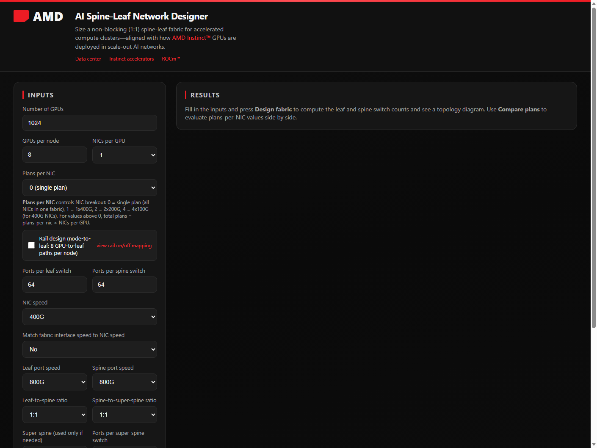
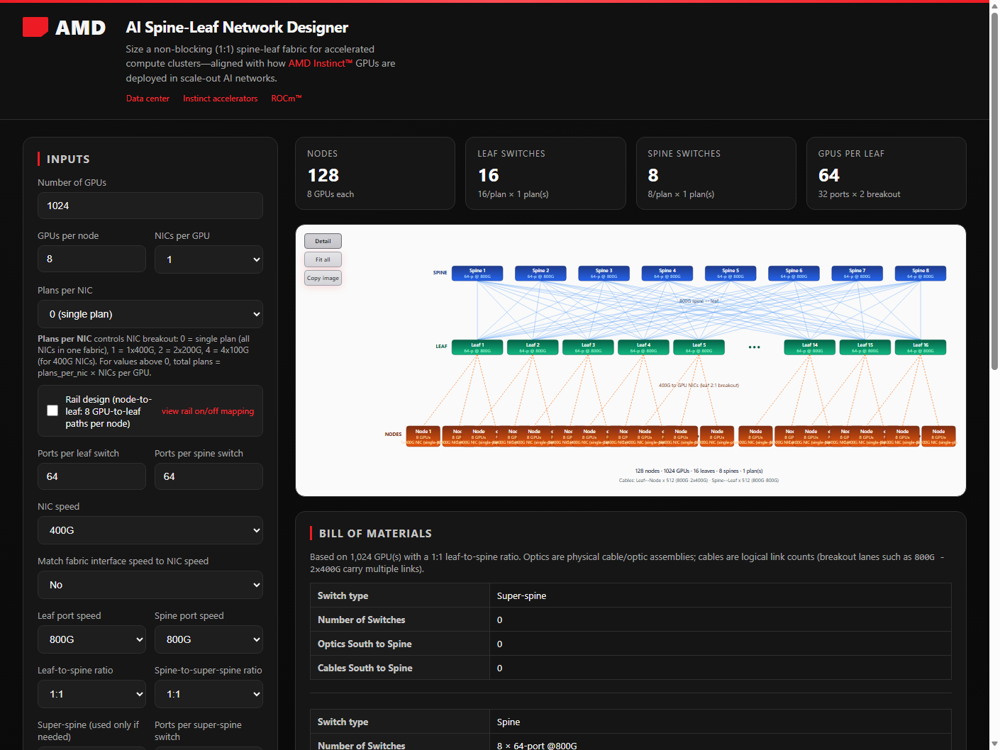
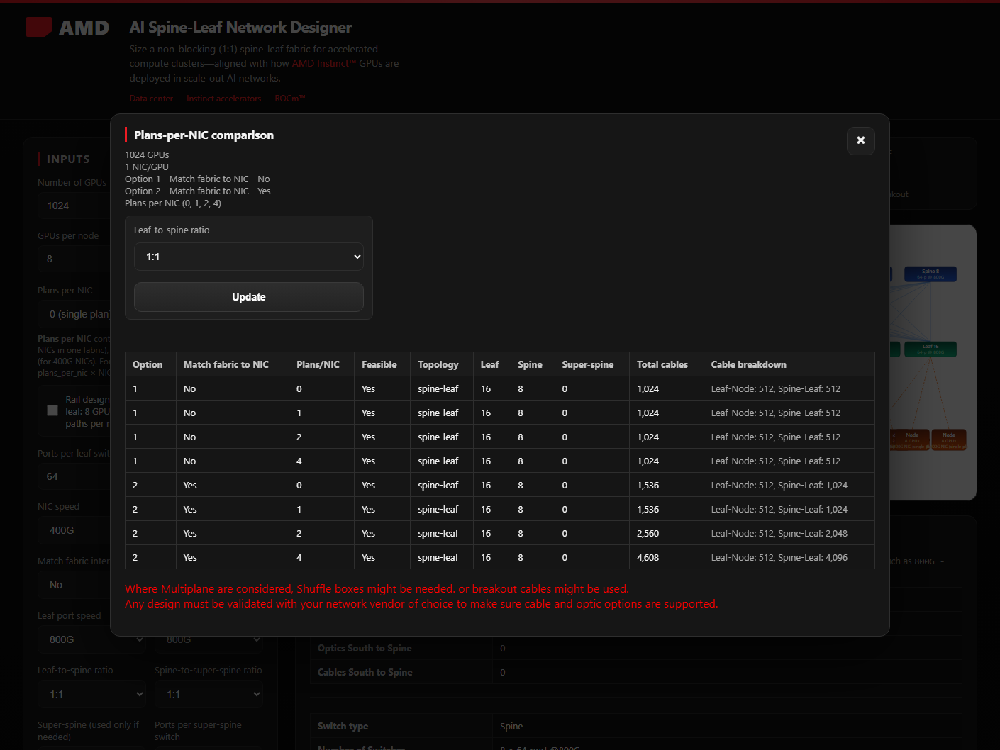
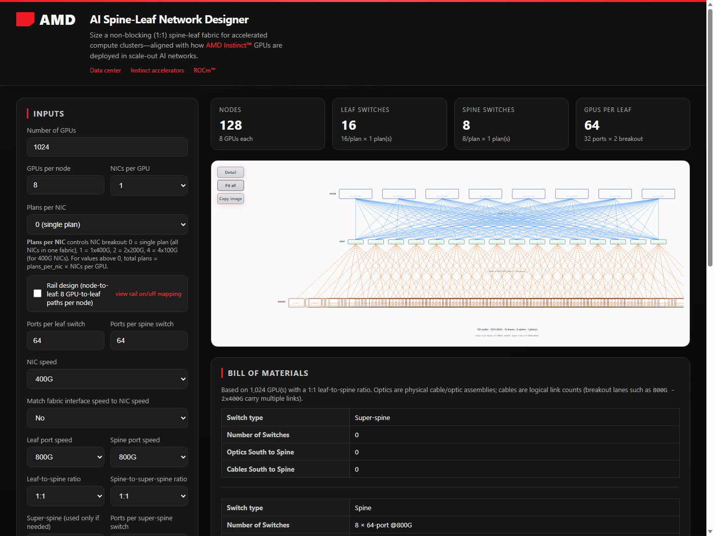
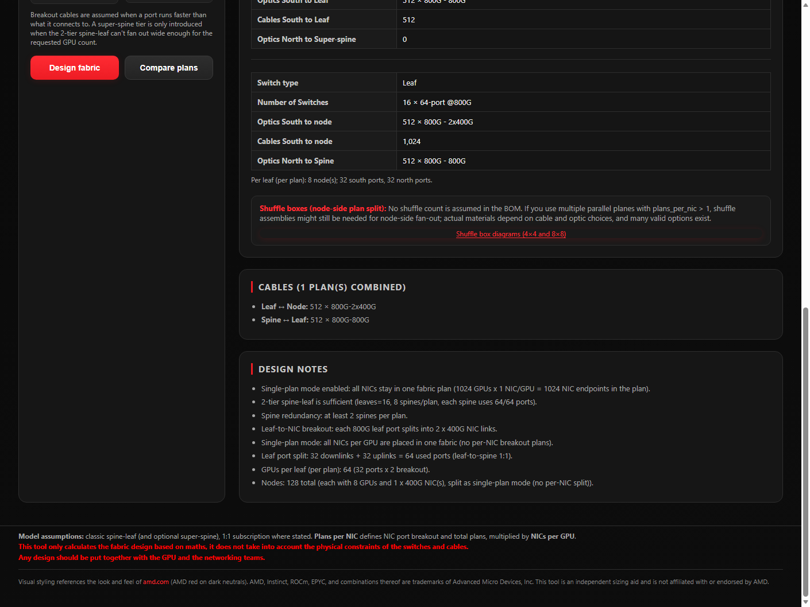
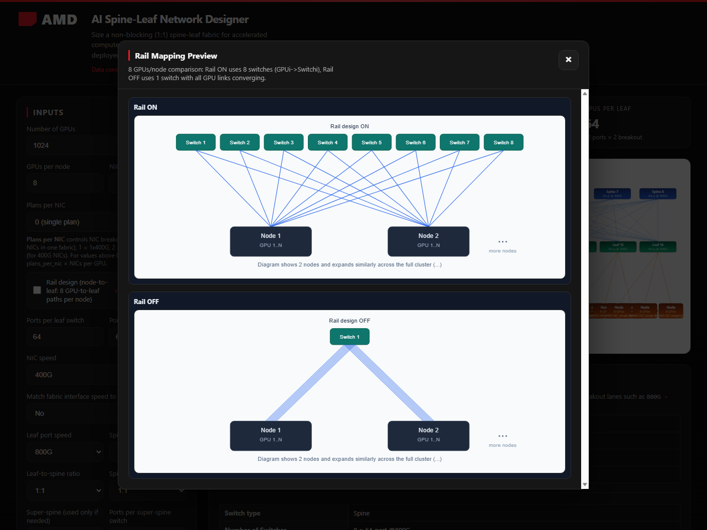

# AI Spine-Leaf Network Designer

A **Flask** web app that sizes a **non-blocking (1:1)** spine-leaf fabric for AI/GPU clusters, optionally adds a **super-spine** tier when radix limits require it, estimates **physical cable groups**, and renders an **SVG** topology diagram. On Windows, it can open in a **native desktop window** via **pywebview** while serving on `http://127.0.0.1:5000/`. In Docker/Podman it runs **browser-only** on port **10000**.

---

## Table of contents

- [Quick start](#quick-start)
  - [Virtual environment](#virtual-environment)
  - [Docker / Podman](#docker--podman)
  - [Native (from source)](#native-from-source)
  - [Windows packaged executable](#windows-packaged-executable)
- [Using the application](#using-the-application)
  - [Input panel](#input-panel)
  - [Design fabric](#design-fabric)
  - [Compare plans](#compare-plans)
  - [Topology diagram](#topology-diagram)
  - [Bill of materials](#bill-of-materials)
  - [Cables and design notes](#cables-and-design-notes)
  - [Rail design preview](#rail-design-preview)
- [Backend functions](#backend-functions)
- [Design assumptions](#design-assumptions)
- [Testing](#testing)
- [Project layout](#project-layout)

---

## Quick start

### Virtual environment

Use a virtual environment for **native runs**, **tests**, and **local development**. Docker/Podman and the packaged `.exe` do not require a local venv on the host.

**Requirements:** Python **3.12+** (matches the Docker image). Runtime dependencies are in [`requirements.txt`](requirements.txt): **Flask**, **pywebview** (native window only).

**Windows (PowerShell)** — from the project root:

```powershell
cd "C:\path\to\AInetworkingscaling"
python -m venv .venv
.\.venv\Scripts\Activate.ps1
pip install -r requirements.txt
```

**macOS / Linux** — from the project root:

```bash
cd /path/to/AInetworkingscaling
python3 -m venv .venv
source .venv/bin/activate
pip install -r requirements.txt
```

If you use **uv**, activate the venv first, then:

```bash
uv pip install -r requirements.txt
```

For **tests**, with the venv still active:

```bash
pip install pytest
pytest
```

### Docker / Podman

The container serves the app with Flask on **port 10000** (no pywebview inside the container). Open **http://localhost:10000/** in a browser.

**Docker Compose** (from the project root):

```bash
# Build
docker compose build

# Start in background
docker compose up -d

# Rebuild and restart after code changes (app.py, templates, static, etc.)
docker compose up -d --build

# Clean rebuild (ignore Docker layer cache)
docker compose build --no-cache
docker compose up -d

# Restart only — same image, no rebuild (config/env tweaks inside the container)
docker compose restart

# Stop
docker compose down
```

**Docker without Compose:**

```bash
docker build -t ainetwork-designer .
docker run --rm -p 10000:10000 --name ainetwork-designer ainetwork-designer
```

**Podman equivalents:**

```bash
podman build -t ainetwork-designer .
podman run --rm -p 10000:10000 --name ainetwork-designer ainetwork-designer
```

Or use `podman compose` in place of `docker compose` if your environment provides it.

### Native (from source)

Create and activate the [virtual environment](#virtual-environment) first, then start the app.

#### Windows

**Option A — desktop window (default)**

With `.venv` active:

```powershell
python app.py
```

A window titled **AI Cable Calculator** opens once the server is ready. You can also browse to **http://127.0.0.1:5000/**.

**Option B — browser only**

In `app.py`, in the `if __name__ == "__main__":` block, set:

```python
browser_only = "True"
```

With `.venv` active, run `python app.py` and use **http://127.0.0.1:5000/**.

#### macOS and Linux

**Browser only (simplest)**

Set `browser_only = "True"` in `app.py` (same as above). With `.venv` active:

```bash
python app.py
```

Open **http://127.0.0.1:5000/**.

**Native pywebview window (Linux)**

Install GTK/WebKit dependencies that pywebview needs, for example on Debian/Ubuntu:

```bash
sudo apt install python3-gi python3-gi-cairo gir1.2-webkit2-4.0
```

Keep `browser_only = "False"`. With `.venv` active, run `python app.py`.

### Windows packaged executable

A pre-built single-file executable is included at [`output/AIScaling.exe`](output/AIScaling.exe). Copy the `output` folder (or the `.exe` plus bundled assets if you rebuild with PyInstaller) and run the executable. See [`notes.txt`](notes.txt) for PyInstaller / auto-py-to-exe build steps.

---

## Using the application

The UI is a two-column layout: **inputs** on the left, **results** on the right. Submit with **Design fabric** for a single design, or **Compare plans** to open a comparison modal.

### Input panel

Configure cluster size, NIC breakout, switch radix/speed, port ratios, and optional super-spine tier.

| Field | Purpose |
|--------|---------|
| **Number of GPUs** | Total GPUs in the cluster |
| **GPUs per node** | Drives server/node counts in outputs |
| **NICs per GPU** | 1, 2, or 3; multiplies parallel physical fabrics when combined with plans per NIC |
| **Plans per NIC** | `0` = single fabric plan; `1`, `2`, or `4` = logical breakout legs per NIC (e.g. 4×100G from one 400G NIC) |
| **Rail design** | When enabled, models dedicated GPU-to-leaf paths per node (`gpus_per_node` paths per node) |
| **Ports per leaf / spine / super-spine** | Switch radix at each tier |
| **NIC / leaf / spine speed** | Independent port speeds (400G, 800G, 1.6T where allowed) |
| **Match fabric interface speed to NIC speed** | When **Yes**, leaf↔spine and spine↔super-spine use NIC-speed breakout lanes even if switch ports are faster |
| **Aggressive sizing (minimum devices)** | **No** (default) is best-practice Clos: even full leaf–spine mesh and at least two spines. **Yes** sizes spines from aggregate port fill only, which can use fewer switches (e.g. 11 leaves / 6 spines vs 11 / 8 for 672 GPUs at 800G switch / 400G NIC) |
| **Leaf-to-spine ratio** | Port allocation between downlinks (nodes) and uplinks (spines): `1:1`, `1:1.1`, `1:1.16`, `1:1.20` |
| **Spine-to-super-spine ratio** | Same ratio options for spine uplinks when a third tier is used |
| **Super-spine speed / ports** | Optional third tier at 800G or 1.6T; used only when a 2-tier design cannot fan out |



### Design fabric

**Design fabric** runs the sizing engine and shows:

- **KPI cards** — nodes, leaf switches, spine switches (and super-spines when used), GPUs per leaf
- **Topology diagram** — SVG sketch of spines, leaves, and nodes with cable annotations
- **Bill of materials** — switch counts and optic/cable breakdown by layer
- **Cable summary** — grouped counts with breakout labels (e.g. `800G-2x400G`)
- **Design notes** — feasibility, topology choice, bundling, and breakout explanations

Default example: **1024 GPUs**, **8** per node, **64-port** leaf/spine, **400G** NIC, **800G** leaf/spine links, single plan (`plans_per_nic = 0`).



### Compare plans

**Compare plans** evaluates **plans per NIC** values **0, 1, 2, and 4** for both **Match fabric to NIC: No** and **Yes**, using your other inputs. The modal table shows feasibility, topology, switch counts, total cables, and a cable breakdown. Change **Leaf-to-spine ratio** in the modal and click **Update** to re-run the matrix.



### Topology diagram

After a design run, the diagram panel includes:

| Control | Action |
|---------|--------|
| **Detail** | Zoomed view with representative switch slots |
| **Fit all** | Entire fabric scaled to fit |
| **Copy image** | Copy the visible diagram to the clipboard as PNG |



Supported topologies:

- **single-switch** — entire plane collapses onto one leaf when radix allows
- **spine-leaf** — classic two-tier non-blocking fabric
- **3-tier** — spine pods aggregated by super-spine when spine radix is insufficient

### Bill of materials

The BOM lists **super-spine**, **spine**, and **leaf** layers with:

- Switch quantity and specification (radix @ speed)
- **Optics** (physical assemblies) and **cables** (logical link counts) south and north
- **Shuffle boxes** — planning hint when multi-plane NIC breakout may need node-side plan splitting; includes reference diagrams (4×4 and 8×8)



### Cables and design notes

**Cables** aggregates physical cable groups across all parallel plans (planes), labeled by endpoints and breakout form (faster-side-first, e.g. `800G-2x400G`).

**Design notes** explain port splits, link bundling, oversubscription checks, super-spine introduction, and infeasibility reasons.

### Rail design preview

Enable **Rail design** to model one GPU-to-leaf path per GPU on each node. Click **view rail on/off mapping** for a side-by-side explanation of standard vs rail cabling.



---

## Backend functions

Core logic lives in [`app.py`](app.py).

| Function | Role |
|----------|------|
| `design_fabric(inp: DesignInputs) -> DesignResult` | Public entry point; validates inputs and returns switch counts, cables, notes, topology, and BOM |
| `_design_fabric_compute(inp)` | Main sizing algorithm: leaf/spine/super-spine counts, port splits, link bundling, multi-plan planes |
| `build_bill_of_materials(result) -> BillOfMaterials` | Builds layered BOM (super-spine / spine / leaf) with optics and cable details |
| `_compute_cables(...)` | Derives cable groups and breakout labels between tiers |
| `render_svg(result, diagram_zoom) -> str` | Renders SVG topology (`detail` or `fit` zoom modes) |
| `_build_plan_comparison(form) -> list[dict]` | Runs the compare-plans matrix for plans 0/1/2/4 × match-to-NIC yes/no |
| `index()` | Flask route (`GET`/`POST` `/`) — form handling, validation, template render |

Key datatypes: `DesignInputs`, `DesignResult`, `PlaneDesign`, `CableGroup`, `BillOfMaterials`.

---

## Design assumptions

- **Non-blocking (1:1)** — aggregate GPU bandwidth is not oversubscribed on the uplink path (see in-app design notes for the inequality used).
- **Two-tier connectivity** — **Best practice** (default): every leaf connects to every spine in a plane with equal link counts; the tool may **bundle** multiple links per leaf–spine pair to reduce spine count within radix, and keeps at least two spines. **Aggressive sizing**: spine count is `ceil(leaf uplinks / spine port capacity)` and may be an incomplete mesh, so fewer switches can suffice.
- **Speed rules** — allowed speeds are integer multiples of **400G**; leaf speed ≥ effective per-plan NIC speed; breakout assumed when a port is faster than its peer.
- **Multi-plan sizing** — parallel plans are **separate physical fabrics**; **every GPU participates in every plan** at the per-plan link speed (NIC breakout / shuffle), not “GPUs ÷ number of plans.”
- **Super-spine** — third tier is introduced only when configured and `_design_fabric_compute` cannot place the cluster on two tiers; otherwise the result is **infeasible** with explanatory notes.
- **Port ratios** — `leaf_spine_ratio` and `spine_super_ratio` bias how many ports on a switch face south vs north (`down:up` format).

---

## Testing

Use the [virtual environment](#virtual-environment) setup above (`pip install pytest` is included there). From the repository root with `.venv` active:

```bash
pytest
```

Tests cover multi-plan sizing, rail design, spine redundancy, aggressive vs best-practice sizing, SVG rendering, and related design paths. Configuration is in [`pytest.ini`](pytest.ini).

---

## Project layout

```
AInetworkingscaling/
├── app.py                 # Flask app + design engine
├── templates/index.html   # UI
├── static/                # Favicon, shuffle-box reference images
├── tests/                 # pytest suite
├── Dockerfile             # Container image (port 10000)
├── docker-compose.yaml
├── docs/screenshots/      # README screenshots
├── scripts/               # Maintenance scripts (e.g. screenshot capture)
└── output/AIScaling.exe   # Optional Windows package
```

---

## Example scenarios

**Single fabric (plans per NIC = 0)** — 1024 GPUs, 8 per node, 64-port switches, 400G NIC, 800G leaf/spine: one plane at full NIC speed; see default **Design fabric** screenshot above.

**Multi-plan breakout (plans per NIC = 4)** — same cluster with 4×100G legs per 400G NIC: four parallel fabrics, each sized for **all 1024 GPUs** on 100G legs. Use **Compare plans** to contrast 0 / 1 / 2 / 4 side by side.

**Rail scaling** — increase **NICs per GPU** and/or **plans per NIC** for additional parallel fabrics; enable **Rail design** when each GPU needs its own leaf downlink path.
